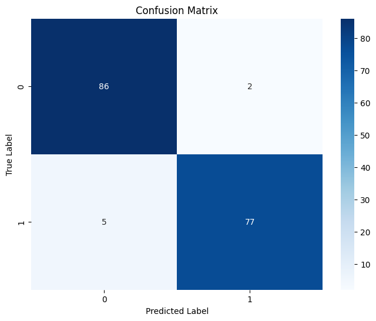
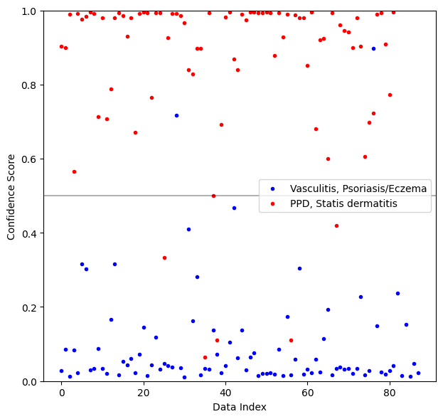

# Binary Classification

## Environment
- Model: Swin Transformer
- Loss: BCEWithFocalLoss

## Optimal Results
### Metrics
|                      | accuracy | precision | recall  | f1-score | support |
|----------------------|----------|-----------|---------|----------|---------|
| Vasculitis/Psoriasis | x        | 0.9451    | 0.9773  | 0.9609   | 88      |
| PPD/Statis           | x        | 0.9747    | 0.9390  | 0.9565   | 82      |
| Total                | 0.9588   | 0.9598    | 0.9581  | 0.9587   | 170     |

### Confusion Matrix

### Confidence Score

