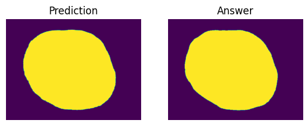

# U-Net Implementation
An implemenentation of U-Net Architecture for HAM10000 Dataset from scratch.

## Top-5 Result

**Top 1** \
IoU: 0.9824

**Top 2** \
IoU: 0.9821

**Top 3** \
IoU: 0.9815

**Top 4** \
IoU: 0.9809

**Top 5** \
IoU: 0.9801

